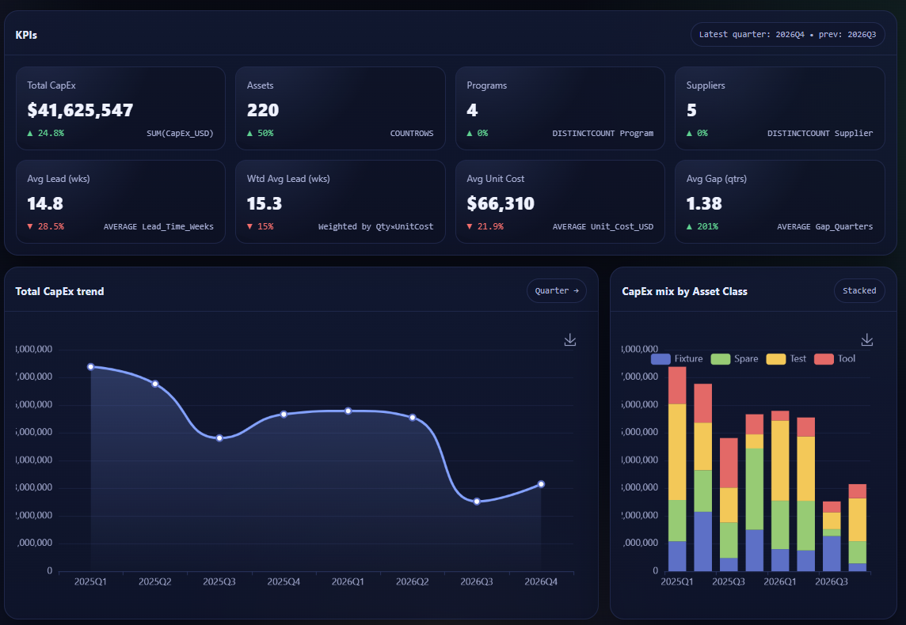

# CapEx Forecasting Engine 📈🛠️
Driver-based CapEx forecasting + an interactive performance dashboard for hardware / manufacturing programs.

<p align="left">
  <a href="https://quantumaster007.github.io/capex-forecasting-engine/CapEx%20Performance%20Dashboard.html"><b>🔗 Open Live Dashboard</b></a>
  &nbsp;•&nbsp;
  <a href="models/capex_forecast_model.ipynb"><b>📓 Forecast Notebook</b></a>
  &nbsp;•&nbsp;
  <a href="docs/model_explanation.md"><b>🧠 Model Explanation</b></a>
  &nbsp;•&nbsp;
  <a href="data/sample_capex_input.xlsx"><b>📄 Sample Input</b></a>
  &nbsp;•&nbsp;
  <a href="exports/"><b>📦 Exports</b></a>
</p>

<!-- Optional badges (uncomment if you like)

-->

---

## ✨ What this repo is
This project turns CapEx line-items into **decision-ready insights**:

- **Forecasting engine (Python / notebook):** driver-based planning (demand, lead times, ramps, depreciation) with scenarios  
- **Interactive dashboard (HTML / GitHub Pages):** KPIs, trends, mix, heatmaps, program/supplier concentration, drill-down detail

> **Use it for:** CapEx planning, NPI/ramp readiness reviews, supplier risk focus, and exec-friendly summaries.

---

## 🖥️ Interactive Dashboard (GitHub Pages)
**Live dashboard:**  
👉 https://quantumaster007.github.io/capex-forecasting-engine/CapEx%20Performance%20Dashboard.html

**What you can do**
- Filter by quarter / program / supplier / fab / process / criticality  
- Click charts to cross-filter (treemap, heatmap, trend, etc.)
- Export **filtered CSV** for analysis
- Drill into the **detail table** (sort + search)

### Add your screenshots here
> Put images in `docs/images/` and update the paths below.




---

## 🔎 Key Findings (from the included sample data + exports)
> These numbers come from `data/sample_capex_input.xlsx` and the generated tables under `exports/`.

### Scenario totals (Order-period spend)
- **Base:** $20,683,800
- **Upside:** $3,130,000
- **Downside:** $1,590,000

### Base scenario spend timing
- **2025Q1:** $14,043,800
- **2025Q2:** $5,950,000
- **2025Q3:** $690,000

### Base scenario concentration (top drivers)
**Top programs by CapEx**
- 3nm Logic NPI — $6,970,000
- Yield Improvement 5nm — $3,450,000
- LPDDR6 DRAM — $2,940,000

**Top suppliers by CapEx**
- ASML — $4,200,000
- KLA — $3,220,000
- Tokyo Electron — $2,940,000

### Readiness signals (Base)
- **Avg lead time:** 14.5 weeks  
- **Weighted avg lead time (CapEx-weighted):** 24.9 weeks  
- **Avg unit cost:** $699,790

---

## 🧩 How it works (data → model → outputs → dashboard)
1. **Input**: `data/sample_capex_input.xlsx` (or your dataset with the same schema)
2. **Model logic**: `models/capex_forecast_model.ipynb` + `src/helpers.py`
3. **Exports**: CSV outputs in `exports/` (quarterly CapEx + depreciation tables)
4. **Dashboard**: `CapEx Performance Dashboard.html` consumes your CSV (via upload) and visualizes KPIs + breakdowns

---

## 📂 Repo Structure
```
capex-forecasting-engine/
├─ CapEx Performance Dashboard.html   # Interactive HTML dashboard (GitHub Pages)
├─ app.py                             # Streamlit app (optional local UI)
├─ data/
│  └─ sample_capex_input.xlsx
├─ exports/
│  ├─ quarterly_capex.csv
│  ├─ quarterly_depreciation.csv
│  └─ annual_depreciation_by_program.csv
├─ models/
│  ├─ capex_forecast_model.ipynb
│  ├─ capex_forecast_model.html
│  └─ capex_forecast_model.pdf
├─ src/
│  └─ helpers.py
└─ docs/
   └─ model_explanation.md
```

---

## 🚀 Getting Started

### Option A — Open the Dashboard (fastest)
1. Open: **Live Dashboard**  
2. Use **Upload CSV** inside the dashboard to load your CapEx export

### Option B — Run the Forecast Notebook
1. Open `models/capex_forecast_model.ipynb`
2. Load `data/sample_capex_input.xlsx`
3. Run all cells
4. Review outputs in `exports/` (CapEx + depreciation tables)

### Option C — Run the Streamlit App (local)
```bash
pip install pandas numpy streamlit altair openpyxl
streamlit run app.py
```

---

## 📑 Input Schema (forecast model)
The notebook expects fields like:
- Asset details: `Asset_ID`, `Asset_Type`, `Asset_Class`, `Supplier_Name`, `Process_Area`
- Financials: `Quantity`, `Unit_Cost_USD`, `Currency`
- Timing: `Order_Quarter`, `Need_Quarter`, `Ramp_Start_Quarter`, `Ramp_Profile`
- Finance: `Depreciation_Years`
- Grouping: `Project_Code`, `Program_Name`
- Risk: `Criticality`, `Region`, `Fab_Location`, `Scenario`

See: `docs/model_explanation.md`

---

## 🗺️ Roadmap (optional)
- [ ] Add budget vs actual variance
- [ ] Add scenario toggles inside the HTML dashboard (Base/Upside/Downside)
- [ ] Add risk scoring (lead time × criticality × spend exposure)
- [ ] Add one-click “Exec Summary” export (PNG/PDF)


## 📊 Dashboard Upload Schema
The HTML dashboard expects a CSV with columns:
`YearQuarter, Program_Name, Supplier, Asset_Class, Asset_Type, Criticality, Fab_Location, Process_Area, Qty, Unit_Cost_USD, Lead_Time_Weeks, Gap_Quarters, CapEx_USD`

**Ready-to-upload sample (generated from `data/sample_capex_input.xlsx`):**
- `exports_dashboard_line_items.csv`

> Tip: Put this file under `exports/` (or `data/`) in your repo so anyone can open the dashboard and immediately upload a working sample dataset.
